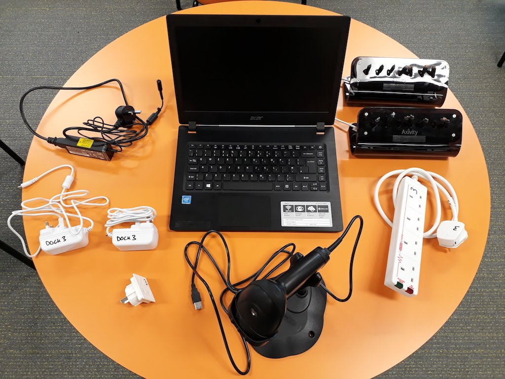
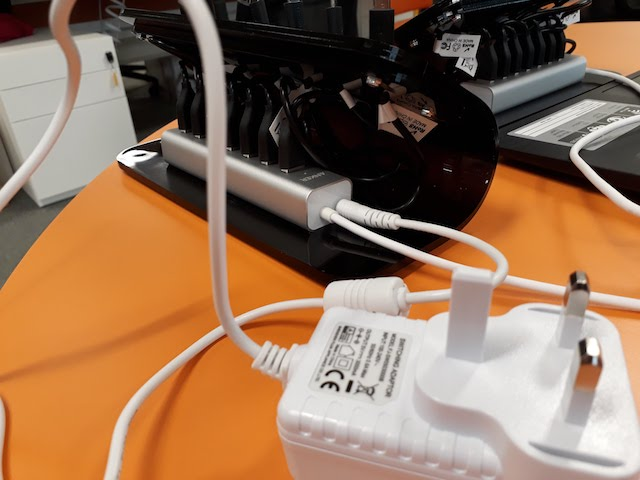
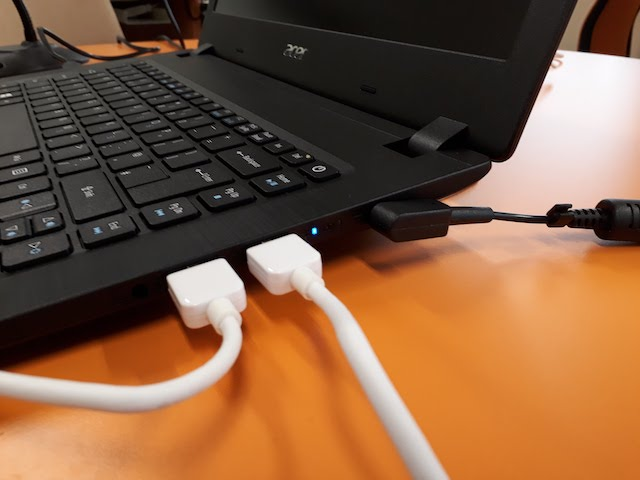
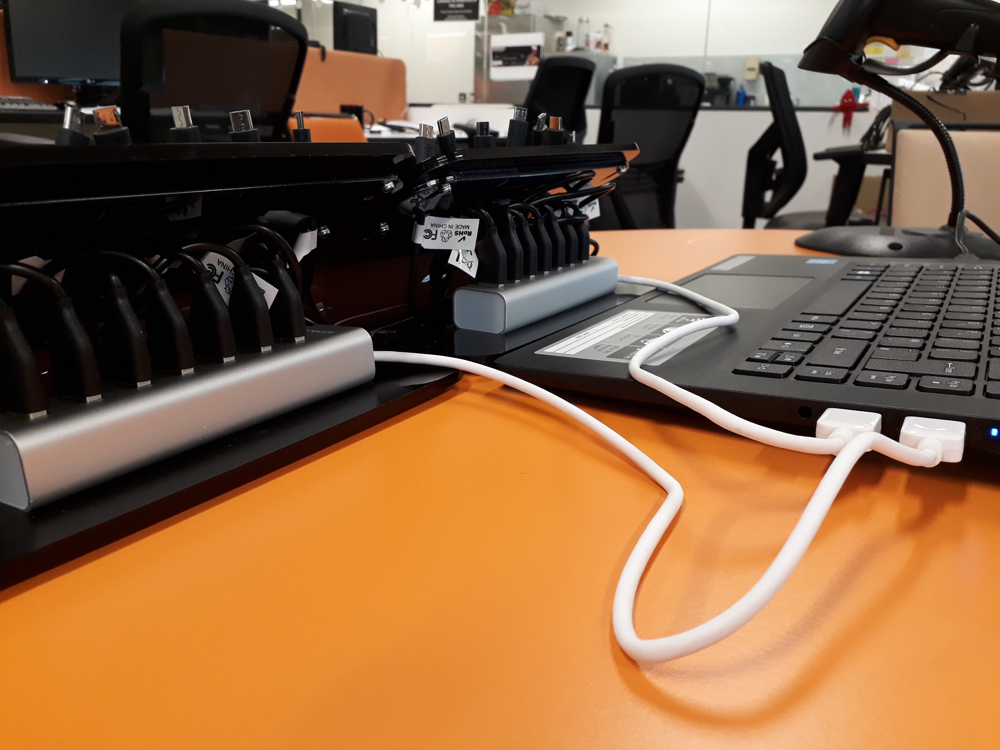
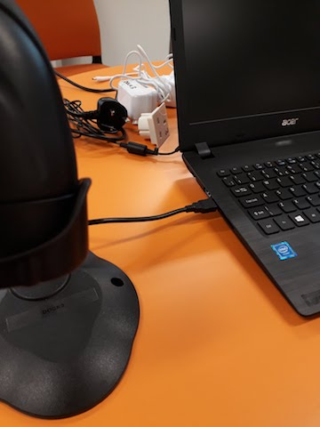

# Dock Setup

Each dock consists of the following components:

* Laptop
* 2 x 7 port docks
* USB Barcode scanner
* Laptop power supply
* 2 x Docker power supplies
* Power strip
* AUS -&gt; UK power converter

## Plug in Docks

Plug in power for each of the 2 docks using the white power blocks.

Plug in USB for each of the 2 docks.

Position docks in front of Laptop for easy access.

## Plug in Barcode Scanner

## Start Software

Start the 'Deploy' application located on the desktop / start menu.

