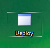

# Using Deploy Software

## Getting Started

* Verify that the laptop has a working internet connection at all times \(otherwise the laptop will not be able to upload the data files, and it does not have much spare capacity\).

### Installing the software

If the software is not already installed, it is available from: [https://openlab.ncl.ac.uk/gitlab/public-pages/ax3-deploy/](https://openlab.ncl.ac.uk/gitlab/public-pages/ax3-deploy/). To install, click the _AX3 Deployment Tool Setup_ link, and run the downloaded _setup.exe_ program. If told _Windows protected your PC_ then click _More info_ and _Run anyway_ -- you will also need to install the _AX3 Driver_ from the same site. Finally, you will need a copy of the configuration settings file `config.ini` placed into the folder `%USERPROFILE%\Documents\AX3`.

> Sometimes, updates will automatically be installed when starting the application. Just follow the boxes and allow it to install, and then it will start with the updates.

### Starting the software

Double-click the _Deploy_ icon from the desktop \(or press the _Start_ button and type `Deploy` to find the launch shortcut\):

### Interface Overview

The user interface is split into several areas:

1. _Configuration setting_: This should be scanned in by the barcode reader, but can be typed if needed.
2. _Configuration information_: Provides information, success messages, and error messages.
3. _Device details_: Lists each attached device grouped by status, including the device id, battery level and status detail.
4. _Diagnostic log_: Typically ignored in normal use, can be checked for further details in the event of a problem.
5. _Cloud upload progress_: which file it is uploading and how many other files are queued for upload.
6. _Available space_: the approximate number of downloads that the drive currently has capacity for.

### Device Status

The status of each device is indicated by the device's LED colour:

| LED Colour | Status | Notes |
| :--- | :--- | :--- |
| ● **White** | Downloading | The data from the device is downloading.  You must wait for the download to complete.  Afterwards, the device will be automatically cleared then enter the charging or charged category. |
| ● **Cyan** | Recharging | The device is cleared but not yet fully charged.  Wait until the device is fully charged. |
| ● **Magenta** | Charged | The is fully charged \(and cleared\).  This device can be configured now, or is ready to be removed for later configuration. |
| ☼ **Flashing Cyan/Off** | Outbox | The device is configured.  Disconnect the flashing device, scan the barcode and place in the envelope. |
| ● **Red** | Unexpected | This device was not expected on the dock, as it has been configured for recording and that recording has not yet finished.  If you are certain that the device was configured in error, use _Device_ / _Destroy Recording_ to manually clear it.  The firmware may temporarily light the LED red while it is clearing or configuring. |
| ● **Blue** | Error | There was a problem with communicating with, or downloading from the device.  If it is a comms. error, press `F9`, `Y` to reset.  If it is a download error, check the drive has enough free space \(waiting for uploads to complete may free-up capacity\). |
| ● **Yellow** / ● **Green** | USB Error | This device is not communicating with the computer \(but is powered or fully charged\). Check the hub's connection and reconnect the device. |
| ◍ **Fading Yellow** / ◍ **Fading White** | Unclassified | This device has not been given a status by the software.  If this persists, try reconnecting the device, restarting the computer and ensuring the drivers are installed. |
| ☼ **Flashing Red** | Starting | The device is starting.  Technically, either in a low-battery pre-charge state, or in the 'bootloader'.  If it persists and fails to start properly, then remove the device from circulation. |

## Operation: Download, Clearing and Recharging

Steps:

1. Fill all free spaces on the docks with devices from the _incoming_ bucket.
2. After the devices settle, you expect to see LEDs which are: **white** \(downloading\) and **cyan** \(cleared and recharging\). Downloading of 14 devices in parallel takes approximately 18 minutes, recharging could take a little longer.
3. When devices turn **magenta** they are fully charged and should be removed to a _charged_ bucket.
4. If any devices turn **blue**: check if it is a download error \(confirm the free space on the laptop, waiting for uploads to complete may free-up capacity\), or a communication error \(press `F9`, `Y` to reset these devices\).
5. Repeat from step 1 while devices remain in the _incoming_ bucket.

## Operation: Configuring

Steps:

1. Fill free spaces on one or more docks with devices from the _charged_ bucket.
2. After the devices settle, you expect to mainly see LEDs which are **magenta** \(charged\), and perhaps some **cyan** \(recharging\).
3. On a laptop with at least one **magenta** \(charged\) device, scan the barcode from the letter. The configuration numbers should appear at the top, and one of the devices \(the most charged\) will be configured and start to flash.
4. Remove the flashing device from the dock.
5. Scan the device you have removed \(this double-checks the device is the configured one\).
6. Place the device in the envelope \(with the letter\).
7. Repeat from step 3, or step 1 if you need more devices.

